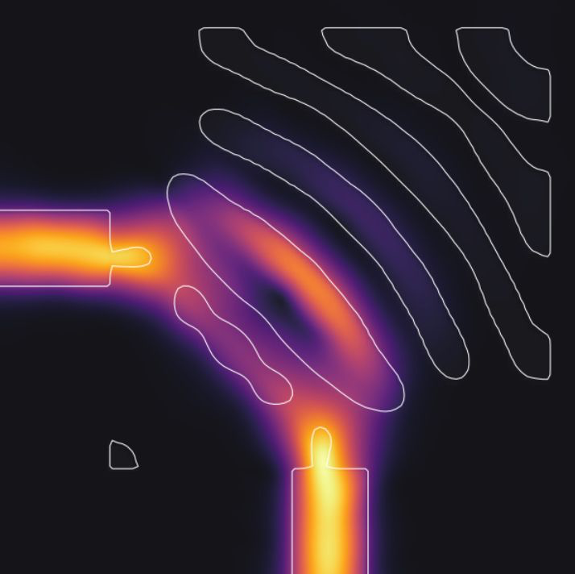
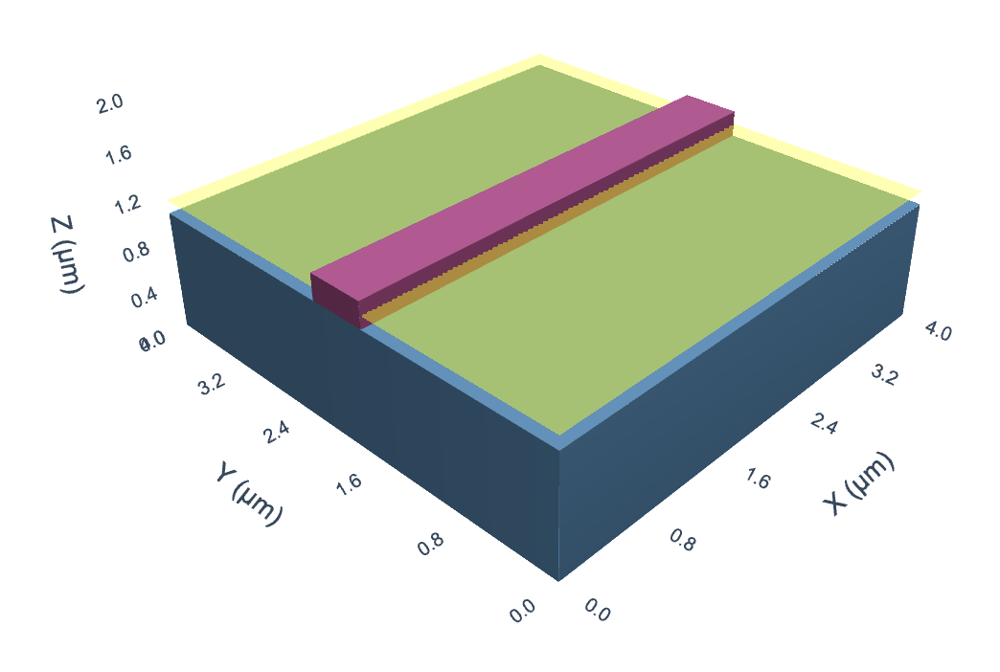

# Example Notebooks for [BEAMZ](https://github.com/quentinwach/beamz)

Setup with [uv](https://github.com/astral-sh/uv): `uv sync && source .venv/bin/activate && jupyter lab`

## Notebooks

| Name & Link | Image | Notes | Author |
|------|-------|-------|--------|
| [Topology Optimized 90° Bend](./topo_opt_bend.ipynb) |  | Demonstrates topology optimization of a 90° waveguide bend using auto-differentiation in a 2D FDTD simulation | [Quentin Wach](https://github.com/QuentinWach) |
| [3D Slap Waveguide](./3d_wg.ipynb) |  | Finding the modes of a slap waveguide in 3D, calculating the effective index, and FDTD. | [Quentin Wach](https://github.com/QuentinWach) |
| [Animation Demo](./animation_demo.ipynb) | - | Live preview of the $E_z$ field in a 2D ring resonator simulation. | [Quentin Wach](https://github.com/QuentinWach) |

